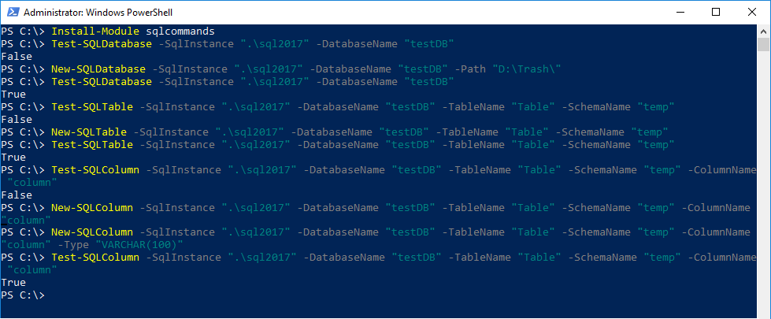
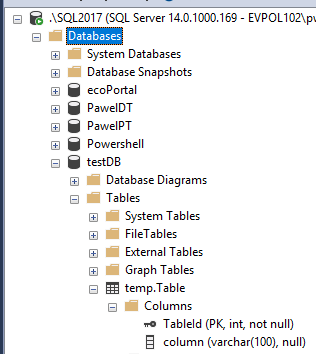

<!--Category:PowerShell,SQL--> 
 <p align="right">
    <a href="https://www.powershellgallery.com/packages/ProductivityTools.PSSQLCommands/"></a>
    <a href="http://productivitytools.tech/sql-commands/"><a> 
    <a href="https://github.com/pwujczyk/ProductivityTools.PSSQLCommands"></a>
</p>
<p align="center">
    <a href="http://http://productivitytools.tech/">
        
    </a>
</p>


# ProductivityTools.PSSQLCommands

The module helps to perform basic operations on the SQL Server. It wraps SQL queries into methods making basic SQL operation more convenient.

<!--more-->

Using this module instead of invoking query:

```SQL
CREATE TABLE [schema].[TableName] (TableNameId INT IDENTITY(1,1) PRIMARY KEY
```

We can use the method

```Powershell
New-SQLTable -SqlInstance "localhost" -DatabaseName "TableName" -SchemaName "schema"
```

Methods are protected against invoking them twice. So before adding a column, check is performed if the column doesn’t already exist.

- Test-SQLDatabase – checks if the database exists returns $true or false
- Drop-SQLDatabase – drop database if exists. If the database does not exist nothing happens. If -Verbose parameter used information showed about this fact on the screen.
- New-SQLDatabase – create the database. If database exists nothing is done. If -Force parameter is used, before create Drop-SqlDatabase is invoked
- Test-SQLTable – checks if the table with given name and schema exists
- Drop-SQLTable – drops table if the table doesn’t exist nothing happens
- New-SQLTable – create a new table if -Force is used first Drop-SQLTable is invoked. If the used schema doesn’t exist it will be created (New-SQLSchema is invoked) Table is created only with primary key and one column Add-SQLColumn can be combined to create full table
- Test-SQLColumn – checks if the column exists
- Drop-SQLColumn – drops column if the column doesn’t exist nothing happen
- New-SQLColumn – create new column if -Force parameter is used Drop-SQL Column is invoked before the creation
- Test-SqlSchema – checks if schema exists
- Drop-SqlSchema – drops schema. If the schema doesn’t exist nothing happen
- New-SqlSchema – create a new schema
- Invoke-SQLQuery – invokes a query
- Invoke-SQLScripts  – it takes all scripts from a given directory and invokes them one by one
The module is dependent on the SQL module (as written in the RequiredModules section.

```
RequiredModules = @("SqlServer")
```

If you have installed previous version of the module from sql (SQLPS) during the installation error occur. (it could be checked using command Get-Module SQLPS)

```powershell
Import-Module : The following error occurred while loading the extended type data file: Error in TypeData "Microsoft.SqlServer.Management.Smo.NamedSmoObject": The member DefaultKeyPropertySet is already present.
Error in TypeData "Microsoft.SqlServer.Management.Smo.NamedSmoObject": The member DefaultDisplayPropertySet is already present.
Error in TypeData "Microsoft.SqlServer.Management.Smo.NamedSmoObject": The member DefaultDisplayProperty is already present.
```

It can be easily fixed removing old module, the new one (SQLServer) replace old one. (http://www.mikefal.net/2016/07/12/out-with-the-sqlps-in-with-the-sqlserver/)

```powershell
Remove-Module SQLPS 
Import-Module SQLCommands
```

The following picture shows the possible option of the database creation with one table and one column

<!--og-image-->


Commands will result in the following structure:

